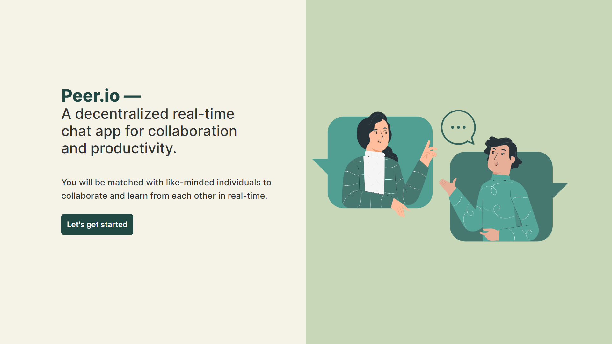
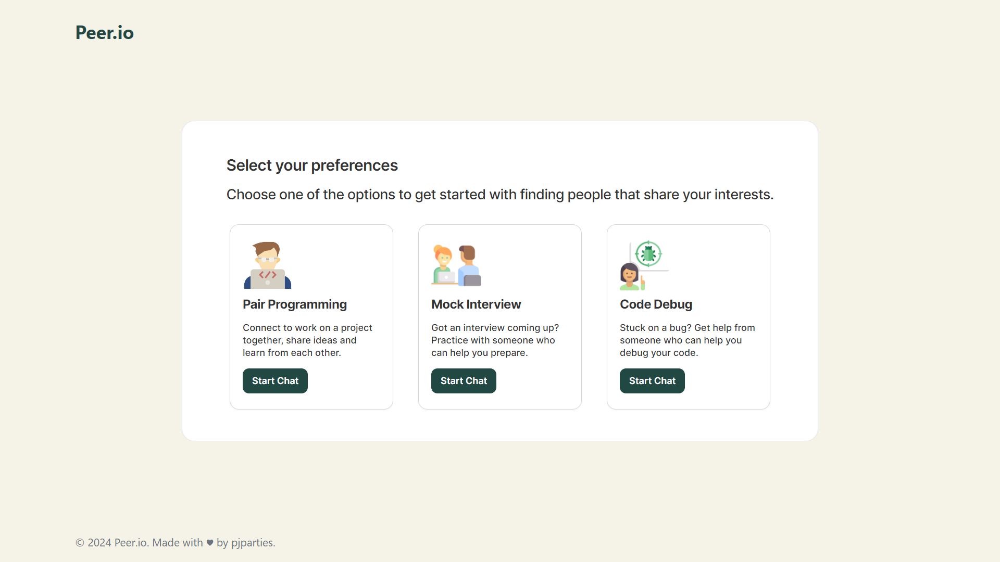
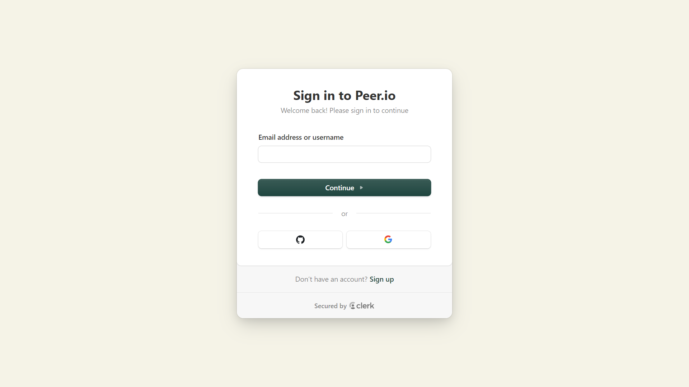

# Peer-io

## Project Overview:
Peer-io is a decentralized real-time online chat application built for collaboration and enhancing productivity. 
Select from various activities such as pair programming, mock interviews, code reviews. 
You will be matched with like-minded individuals to collaborate and learn from each other in real time. 
You can share your code, ask questions, and get instant feedback from your peers.

##  Backend Repo 
[Backend](https://www.github.com/pjparties/peer-b)

## Demo:

## Usage:
Peer-io offers a simple and intuitive user interface for uploading and downloading files. Here's how to use it:
1. Open the Peer-io application in your web browser.
2. Sign up for an account or log in if you already have one (or use as a guest).
3. Select Preferences and click on start Chat.
4. Once you are matched with a peer, you can start collaborating in real-time.

## Features:
- Decentralized chat platform
- Get matched with like-minded individuals
- Real-time collaboration
- Peer-to-peer communication
- Secure and efficient chats
- User-friendly interface

## Premium Version (Coming Soon):
Peer-io offers a premium version with additional features, including:
- High priority matching
- Unlimited skips and matches
- Custom filters and preferences

## Version Info:
Current version: 0.1.1
Release date: February 27, 2024

## Installation:
To install Peer-io, follow these steps:
1. Clone the repository from GitHub: `git clone https://github.com/pjparties/peer-io-frontend.git`
2. Navigate to the project directory: `cd peer-io-frontend`
3. Install dependencies: `npm install`
4. Start the application: `npm run dev`

## Contributing:
We welcome contributions from the community to improve Peer-io. To contribute, follow these steps:
1. Fork the repository on GitHub.
2. Clone your forked repository to your local machine.
3. Create a new branch for your contribution: `git checkout -b feature/new-feature`
4. Make your changes and commit them: `git commit -m "Add new feature"`
5. Push your changes to your forked repository: `git push origin feature/new-feature`
6. Create a pull request on the original repository.
7. Our team will review your pull request and provide feedback.

## License:
This project is licensed under the [MIT License](LICENSE).
